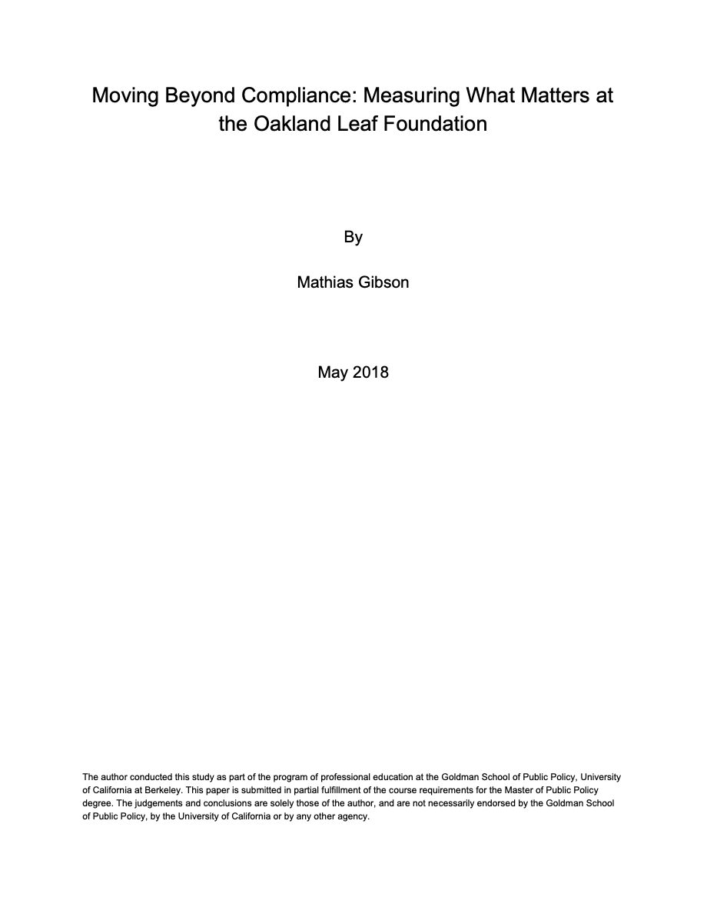

## UC Berkeley Master's in Public Policy, Data Analysis concentration

### Oakland Leaf Foundation

Measured impact, designed and built a performance measurement system (R, Excel)

### Oakland City Council
Built data visualizations of the distribution and characteristics of vacant parcels (Python, GIS)

### Oakland Police Department
Wrote literature review on retention in the recruitment and training process

### Oakland Food Policy Council
Researched, designed, and prototyped a tool aiding labor rights of farm workers

### Breastcancer.org
Evaluated strategic plan with benchmark analysis, ux research, and KPI analysis (Excel, Tableau)

## 2015 Code for America Fellowship

### Miami-Dade County Fellowship Report

